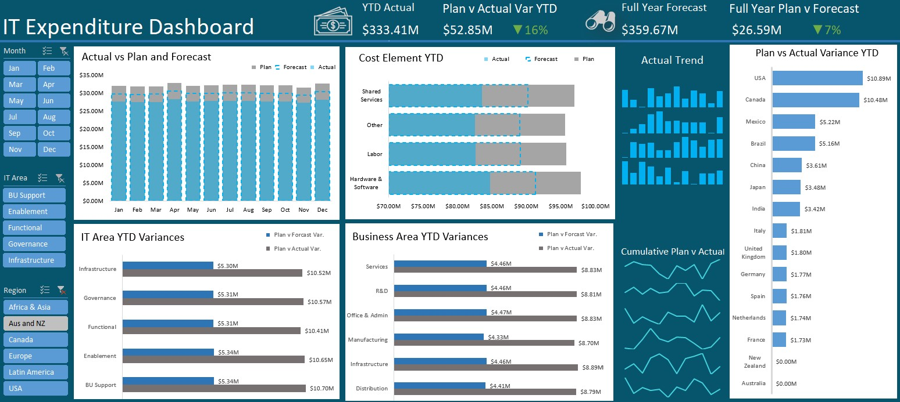

# IT Financial Dashboard – Budget vs Actual Variance & Forecast Monitoring

This project showcases a professionally designed Excel dashboard that monitors IT financial performance by comparing actual spend with budgeted and forecasted values. Built entirely in Microsoft Excel, the dashboard supports financial planning, forecasting accuracy, and spend control across business units, IT areas, and global regions.

## Dashboard Preview

## Project Overview

This dashboard is a comprehensive financial analysis tool for tracking monthly and year-to-date IT spend performance. It compares Plan vs. Actual vs. Forecast, calculates financial variances, and visualizes trends and spend composition to help stakeholders make informed decisions.

The dataset simulates approximately 80,000 rows of IT-related financial transactions, including dimensions such as region, country, department, cost element, and business unit.

## Tools & Features Used

- Microsoft Excel (no add-ins required)
  - PivotTables & PivotCharts
  - Slicers (Month, IT Area, Region)
  - Sparklines (mini trendlines)
  - Conditional formatting (arrows, color-based indicators)
  - Custom number formatting (millions: `$8.35M`)
- Data modeling and structuring
- Dashboard layout using Excel’s native grid system

## Key KPIs and Their Purpose

| KPI | Formula | Description |
|-----|---------|-------------|
| YTD Actual | `=SUM(Actual)` | Total IT spend that has occurred so far this year |
| Plan vs Actual Variance (YTD) | `=SUM(Plan) - SUM(Actual)` | Indicates under or over budget status |
| Variance % (YTD) | `=(Plan / Actual)-1 ` | Highlights magnitude of overspend or underspend |
| Full Year Forecast | `=SUM(Forecast)` | Projected total IT expenditure based on current trends |
| Plan vs Forecast Variance | `=SUM(Plan) - SUM(Forecast)` | Evaluates deviation of projected spend from original plan |

All KPI cards include directional arrows and color coding (green/red) for clear interpretation. Financial values are displayed in millions using: `$#,##0.00,, "M"`.

## Pivot Table Breakdown

**Monthly Trend**
- Rows: Month (Jan–Dec)
- Values: Plan, Forecast, Actual
- Purpose: Visualize month-to-month spend changes

**Cost Element Analysis**
- Rows: Cost Element Groups (Labor, Software, Services, etc.)
- Values: Plan, Forecast, Actual
- Purpose: Identify major drivers of IT expenditure

**IT Area Variance**
- Rows: Departments (Governance, Enablement, etc.)
- Values: Plan vs Actual, Plan vs Forecast
- Purpose: Spot departments deviating from budget

**Geographic View**
- Rows: Country
- Values: Plan vs Actual Variance
- Purpose: Highlight regions contributing to budget variance

**Sparklines and Trendlines**
- Data: Monthly figures by department
- Used to show behavior and seasonal spending patterns

## Use Case and Business Value

This dashboard is a strategic tool for:
- IT finance teams to monitor budget adherence
- FP&A teams for tracking forecast accuracy
- Executives reviewing department-level performance

Benefits include:
- Early detection of overspending
- Improved forecasting accuracy
- Budget optimization across regions and functions

## Highlights

- Built fully in Excel without plugins or add-ins
- Custom KPIs and dynamic visualizations
- Modular layout that supports clear stakeholder communication

## Future Enhancements

- Power BI version of the dashboard
- Integration with real-time data using Power Query

## License

This project is licensed under the MIT License. See the LICENSE file for details.

## Reference

Check out the original Dashboard by Mynda Treacy here: https://www.youtube.com/watch?v=_PlBRWc0RlI

## Contact

If you'd like to connect or share feedback:

- LinkedIn: https://www.linkedin.com/in/anokhih
